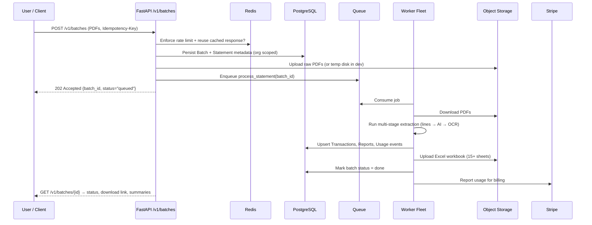
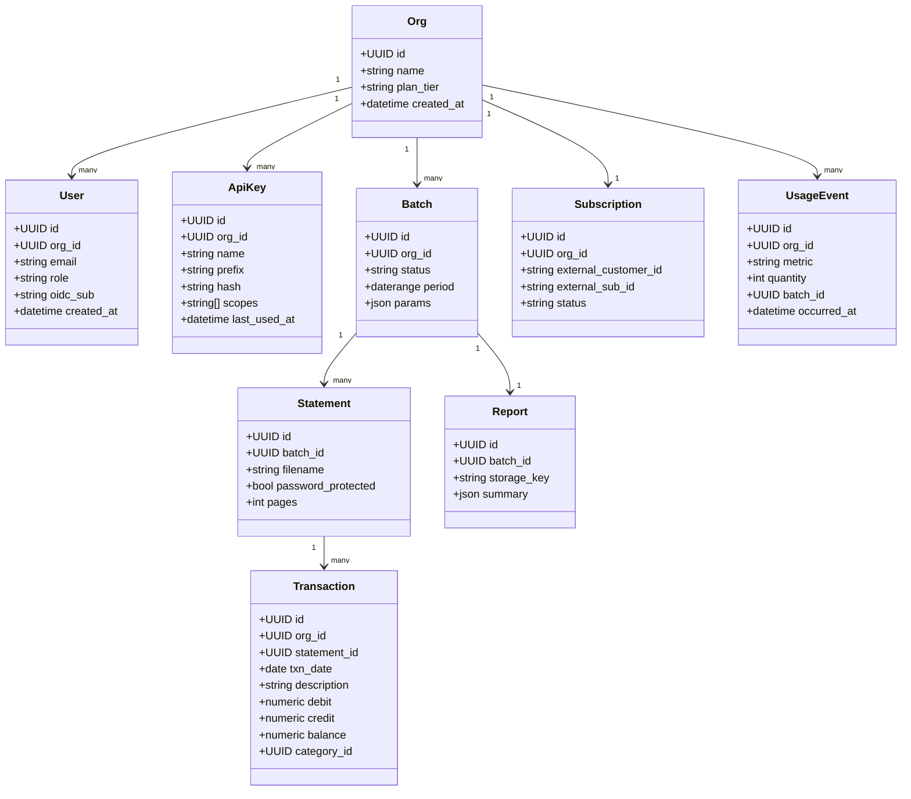

# CypherEdge Backend Scaffold

This document explains how the new `backend/` folder is organized, why each
component exists, and how you can evolve the scaffold into a production-grade,
multi-tenant FastAPI platform. The guide is written twice—first for newcomers, then
for experienced backend engineers—so you can onboard gradually while still having a
deep reference.

---

## 1. Repository Layout (High Level)

```
backend/
├── .env                     # Local-only environment defaults (never use in prod)
├── .gitignore               # Keeps caches, secrets, and temp files out of git
├── requirements.txt         # Dependency pins for the FastAPI service & workers
├── app/                     # Python package housing the service code
│   ├── main.py               # FastAPI application factory (implementation later)
│   ├── api/                  # HTTP interface: routers + dependencies
│   │   ├── routers/          # Request handlers grouped by domain
│   │   └── dependencies/     # Auth, tenancy, and utility dependencies
│   ├── core/                 # Cross-cutting concerns (config, security, observability)
│   ├── domain/               # Business logic, models, events, and schemas
│   ├── infra/                # Technical adapters (DB, cache, external APIs)
│   ├── billing/              # Stripe (or other) integration touchpoints
│   └── workers/              # Background task definitions
└── docs/
    └── ARCHITECTURE.md       # This explainer, diagrams, and onboarding guide
```

Every directory contains either an `__init__.py` or a short placeholder module so
tools like linters and IDEs can already reason about imports even though the actual
logic will arrive later.

---

## 2. Platform Flow (Big Picture Diagram)

```mermaid
flowchart LR
  subgraph Edge
    A[Clients\n• Web UI\n• CLI / Partners\n• Internal tooling]
    A --> B[CDN / WAF]
    B --> C[API Gateway / Ingress]
  end

  C --> D[FastAPI Pods (K8s)]
  subgraph AppTier[FastAPI Application]
    D --> D1[Middlewares\nAuth • Rate Limit • Idempotency • Tracing]
    D1 --> D2[HTTP Routers /v1/*]
    D2 --> D3[Domain Services]
    D3 --> D4[(Repositories\nSQLAlchemy Async)]
    D3 --> D5[Cache Facade\nRedis]
    D3 --> D6[Outbox Publisher]
    D3 --> D7[External Clients\nhttpx (Stripe, OCR, etc.)]
  end

  D4 --> E[(PostgreSQL\nRLS per org)]
  D5 --> F[(Redis\nRate limit • Idempotency • Cache)]
  D6 --> G[[Event Bus\nKafka/Redpanda]]
  D2 --> H[(Queue\nRedis/RabbitMQ)]
  H --> I[Workers\nCelery/Dramatiq]
  I --> J[Extraction Pipeline\npdfplumber • TableTransformer • OCR]
  I --> K[(Object Storage\nS3 or local dev)]
  I --> L[(Usage Exporter\n→ Stripe)]

  D & I --> M[OpenTelemetry Exporter]
  M --> N[Prometheus / Grafana]
  M --> O[Sentry]

  P[Stripe Billing] <-- Signed Webhooks --> D
```

---

## 3. Request Journey (Sequence)



---

## 4. Data Ownership (Class Diagram)



---

## 5. Extraction Strategy (Focused Flow)

```mermaid
flowchart TD
  A[PDF Received] --> B{Text Layer Available?}
  B -- Yes --> C[Test A:\nLines + Lines]
  C -->|Success| Z[Tabular DataFrame]
  C -->|Fail| D[Test B:\nLines + Text]
  D -->|Success| Z
  D -->|Fail| E[Test C:\nAI Columns + Lines]
  E -->|Success| Z
  E -->|Fail| F[Test D:\nAI Columns + Text]
  F -->|Success| Z
  F -->|Fail| G[Test E:\nOCR (PaddleOCR)]
  G -->|Success| Z
  G -->|Fail| H[Flag Page & Continue]
  Z --> I[Cleaning & Normalization]
  I --> J[Categorization Rules]
  J --> K[Balance Validation]
  K --> L[Excel Report Assembly]
  L --> M[Upload + Notify]
```

---

## 6. Beginner-Friendly Explanation

1. **API layer (`app/api/`)** – think of this as the receptionist. It receives HTTP
   requests, checks identification, and forwards work to the specialists. Keeping this
   layer thin means replacing the receptionist’s script does not affect the rest of the
   office.
2. **Core utilities (`app/core/`)** – the shared toolbox. Configuration loading,
   security helpers, and logging live here so every part of the project can easily reuse
   them without duplicating code.
3. **Domain layer (`app/domain/`)** – the brains of the operation. It knows what a
   bank statement is, how to classify transactions, and when to charge customers. By
   separating domain rules from the API framework you keep business logic portable.
4. **Infrastructure (`app/infra/`)** – plugs the app into the outside world: databases,
   Redis, Stripe, object storage, or any third-party API.
5. **Billing (`app/billing/`)** – dedicated space for monetization concerns so payment
   flows never mix with extraction logic.
6. **Workers (`app/workers/`)** – background specialists who take jobs off a queue so
   the API stays snappy even when analyzing large PDFs.

The directories are empty now, but each explains what will eventually go inside. As
you code, always ask “is this business logic?” (belongs in `domain/`), “is it just HTTP
plumbing?” (`api/`), or “is it talking to a service?” (`infra/`). That mental model keeps
the project tidy.

---

## 7. Expert-Level Notes

* **Clean architecture boundaries** – `api/` handles transport, `domain/` owns use
  cases, `infra/` implements interfaces. Dependency direction should flow inward only.
* **Tenancy enforcement** – when you wire SQLAlchemy, set `SET app.current_org = …`
  on each connection so PostgreSQL Row Level Security policies enforce isolation.
* **Idempotency and rate limiting** – the `core/` + `infra/cache/` split keeps storage
  drivers and business policies separate, enabling alternative backends (e.g., DynamoDB
  for Enterprise).
* **Outbox pattern** – the placeholder in `domain/events/` and
  `app/domain/models/outbox.py` anticipates reliable event publication without losing
  transactions. Workers simply poll the outbox table.
* **Testing strategy** – structure allows three layers: unit tests for domain services,
  integration tests for repositories (using Testcontainers), and contract tests hitting
  routers.
* **Observability first** – `core/observability.py` will initialise OpenTelemetry,
  Prometheus, and Sentry; starting with the hook in place ensures every feature you add
  emits traces and metrics automatically.

---

## 8. Start Coding Guide

Follow these steps as you begin to fill in the placeholders.

1. **Create a virtual environment and install dependencies.**
   ```bash
   cd backend
   python3.12 -m venv .venv
   source .venv/bin/activate
   pip install -r requirements.txt
   ```
2. **Configure local services.** Start PostgreSQL and Redis locally (Docker is fine).
   Update `.env` if your ports differ, but never commit real credentials.
3. **Implement configuration loading** in `app/core/config.py` using
   `pydantic-settings`. Expose a `Settings` object and import it wherever environment
   variables are needed.
4. **Wire the application factory** in `app/main.py`. Instantiate `FastAPI`, register
   middleware (CORS, tracing, security), and `include_router` for everything in
   `app/api/routers/`.
5. **Build domain models** in `app/domain/models/`. Start with `Base` (SQLAlchemy
   declarative base), then define `Org`, `Batch`, `Statement`, `Transaction`, etc., using
   the class diagram above as your schema reference.
6. **Create Alembic migrations** once models exist. Place migration scripts in
   `backend/migrations/` (create the directory when ready) and point `env.py` to the
   declarative base.
7. **Populate repositories** under `app/infra/repositories/` so the API layer can
   request or persist data without embedding SQL.
8. **Port your existing extraction logic** into new domain services. Either move the
   code directly into `app/domain/services/extraction_service.py` or temporarily call
   into your legacy modules while refactoring piece by piece.
9. **Introduce workers** by wiring Celery (or Dramatiq) in `app/workers/` and pointing
   the task modules at your domain services.
10. **Add billing features** after the core pipeline works: implement Stripe clients,
    webhook handlers, and usage reporting based on the placeholders in `app/billing/`.

At any point you can keep your original backend code base as a reference—the new
scaffold is flexible enough to absorb it gradually without forcing a big-bang rewrite.

---

## 9. Why Modularization Matters

* **Clarity** – You can open any folder and instantly know whether it contains HTTP
  glue, business rules, or I/O. That lowers onboarding time for new engineers.
* **Testability** – Pure domain services become trivial to test because they do not
  import FastAPI or network clients. Infrastructure adapters can be swapped with fakes
  in integration tests.
* **Scalability** – When workloads grow, you can scale API pods, worker pods, or
  dedicated billing services independently because the boundaries are explicit.
* **Security** – Isolation makes it easier to apply policies like RLS, idempotency, and
  signature verification without threading concerns through unrelated code.

Keep this document open as you begin implementing each layer. Update the stub files
with real code only when their supporting architecture (configuration, DB access,
security policies) is ready, and the project will remain maintainable even as it grows
into the full production system envisioned in the initial CypherEdge report.
